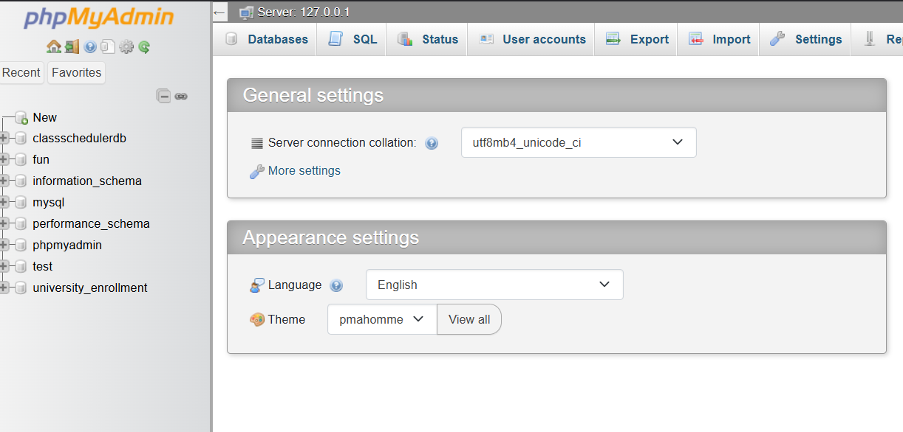
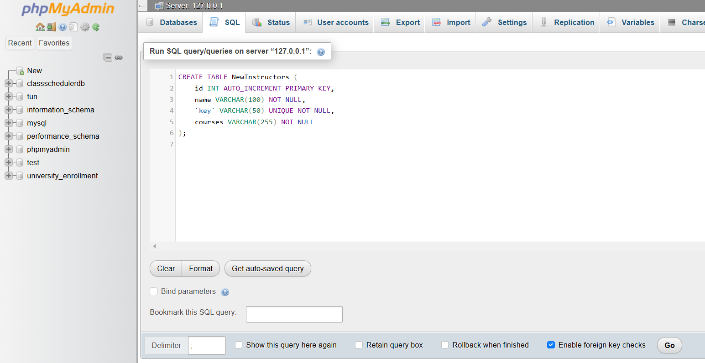
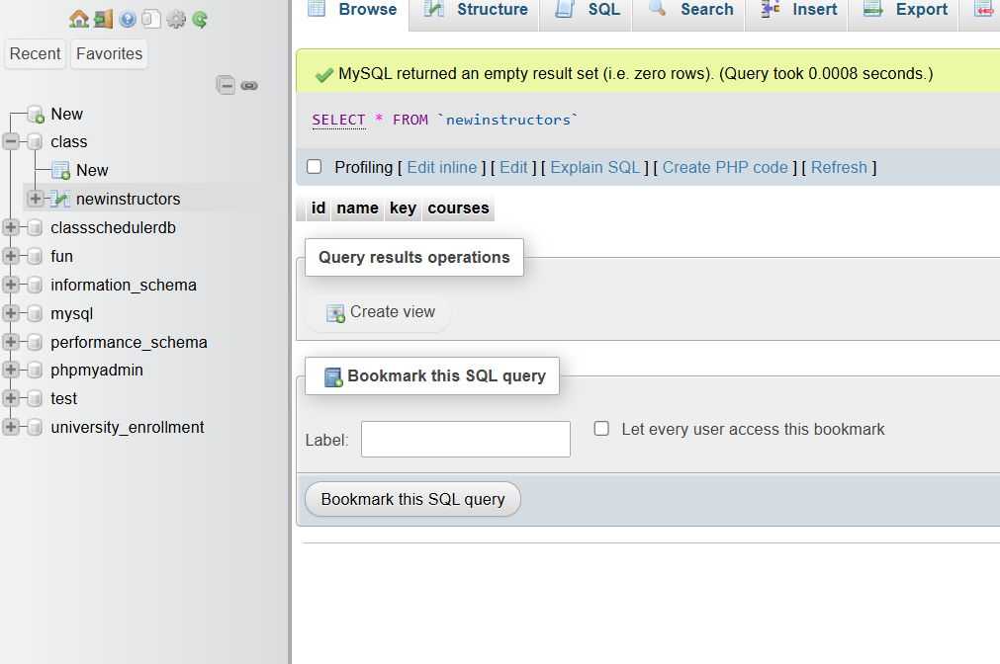

Step by Step Database creation and connection:
1. First go to xampp mysql admin panel
    
2. Select SQL option from the tab menu, then paste this command

    ```
    CREATE DATABASE classschedulerdb;
    USE classschedulerdb;

    CREATE TABLE NewInstructors (
        id INT AUTO_INCREMENT PRIMARY KEY,
        name VARCHAR(100) NOT NULL,
        `key` VARCHAR(50) UNIQUE NOT NULL,
        courses VARCHAR(255) NOT NULL
    );
    ```
    
For tutorial purpose I changed the name of the Database, as I already have one
3. Now select the Go option located down right

4. Now look at the left menu,  you can see the database name.
Click + icon and  you can see the table. Click on it and see all the details
